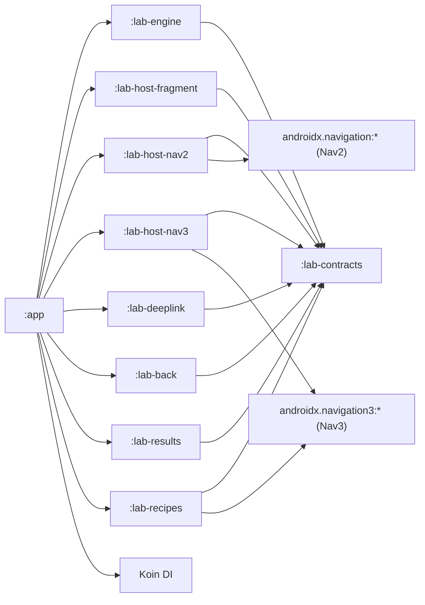

# Navigation Interop Lab

Standalone Android test application that validates Nav2/Nav3 migration patterns -- container ownership, cross-engine routing, hybrid back stacks, deeplink handling, and state restore -- before touching production code. The lab reproduces real navigation patterns in isolated, deterministic scenarios with both manual and automated verification.

## Quick Start

**Prerequisites:** JDK 17, Android SDK 36

```bash
# Build
./gradlew :app:assembleDebug

# Run instrumentation tests
./gradlew :lab-testkit:connectedAndroidTest
```

## Project Structure

| Module | Description |
|--------|-------------|
| `app` | `NavigationLabActivity`, case browser entry point |
| `lab-contracts` | Shared types: `LabCaseId`, `LabScenario`, `LabResult`, `LabRoute`, `LabTraceEvent` |
| `lab-engine` | `NavigationLabEngine`, `CaseBrowserScreen`, orchestrator, invariant checks |
| `lab-host-fragment` | Fragment host topologies and stub fragments |
| `lab-host-nav2` | Nav2 host, Compose screens, Nav2 graphs |
| `lab-host-nav3` | Nav3 host, `NavDisplay` integration |
| `lab-deeplink` | `DeeplinkSimulator`, fake deeplink managers |
| `lab-back` | `BackOrchestrator`, back-handling test infrastructure |
| `lab-results` | Results display, inline trace panel |
| `lab-recipes` | 19 Nav3 recipe scenarios (R01-R19): back stacks, state persistence, transitions, deep links, adaptive layout |
| `lab-testkit` | `androidTest` instrumentation tests (Espresso + Compose) |

All modules depend on `:lab-contracts`. `:app` depends on all modules.

## Host Topologies

| ID | Description |
|----|-------------|
| T1 | `Activity(XML)` -> `FragmentContainerView` -> Fragments |
| T2 | `Activity(XML)` -> `ComposeView` -> Nav2 `NavHost` |
| T3 | `Activity(XML)` -> `ComposeView` -> Nav3 `NavDisplay` |
| T4 | `Activity(XML)` -> `ComposeView` + overlay `FrameLayout` (dual containers) |
| T5 | `Nav3 root` -> `LegacyIslandEntry` -> `AndroidViewBinding(FragmentContainerView)` |
| T6 | Fragment host -> `ComposeView` -> internal Nav2 |
| T7 | Nav2 route -> Nav3 leaf screen |
| T8 | Nav3 key -> Nav2 leaf graph |

## Test Case Families

| Family | Cases | Description |
|--------|-------|-------------|
| **A** | A01-A07 (7) | Container and host ownership |
| **B** | B01-B12 (12) | Nav2/Nav3 interoperability |
| **C** | C01-C08 (8) | XML <-> Compose screen connection |
| **D** | D01-D09 (9) | Dialog/bottom-sheet/overlay semantics |
| **E** | E01-E08 (8) | Back handling and nested stacks |
| **F** | F01-F08 (8) | Deeplink and fallback behavior |
| **G** | G01-G07 (7) | State restore and argument stability |
| **H** | H01-H05 (5) | Transaction safety and race conditions |

**Total: 49 cases** across 8 families covering the full interop surface.

## Recipe Cases (R01-R19)

The `lab-recipes` module contains 19 standalone Nav3 recipe scenarios grouped by topic:

| Group | Recipes | Description |
|-------|---------|-------------|
| **Basic** | R01-R03 | Back stack (`mutableStateListOf`), saveable state (`rememberNavBackStack`), DSL syntax (`entryProvider`) |
| **Interop** | R04 | Fragment/Compose interop (`AndroidFragment`, `AndroidView`) |
| **Migration** | R05-R06 | Nav2 baseline with bottom nav vs Nav3 target with `NavigationState`/`Navigator` |
| **Results** | R07-R08 | Event bus (`ResultEventBus` + Channel) vs state store (`ResultStore` + `rememberSaveable`) |
| **App State** | R09-R12 | Multi-stack tabs (`LifoUniqueQueue`), bottom bar visibility, ViewModel preservation, result consumption (`LaunchedEffect`) |
| **Deep Links** | R13 | URI parsing + synthetic backstack via trampoline activity |
| **Transitions** | R14-R16 | Custom animations (`DefaultTransitions`), dialog (`DialogSceneStrategy`), bottom sheet (`BottomSheetSceneStrategy`) |
| **Adaptive** | R17 | List-detail layout (`ListDetailSceneStrategy` + `WindowSizeClass`) |
| **Conditional** | R18-R19 | Auth gate (`ConditionalNavigator`), advanced deep links with synthetic backstack |

## NavLogger

`NavLogger` (`lab-contracts`) provides structured Logcat output under `TAG="NavRecipe"` for navigation observability. Methods:

`push` | `pop` | `back` | `tabSwitch` | `deepLink` | `redirect` | `result` | `visibility`

All recipe host activities use `NavLogger` to emit events on navigation actions.

## Run Modes

| Mode | Description |
|------|-------------|
| **Manual** | Step-by-step from case browser with inline trace panel visible |
| **Scripted** | Auto-advance through steps with configurable delays |
| **Stress** | Rapid repeated execution to detect race conditions |

## Tech Stack

| Component | Version |
|-----------|---------|
| AGP | 9.1.0 |
| Kotlin | 2.3.10 |
| Compose BOM | 2026.02.01 |
| Navigation 2 | 2.9.7 |
| Navigation 3 | 1.0.1 |
| Koin | 4.1.1 |
| minSdk | 24 |
| targetSdk / compileSdk | 36 |

## CI

GitHub Actions runs instrumentation smoke tests on PR and push to `main`. See `.github/workflows/android-instrumentation-smoke.yml`.

## Architecture

Full blueprint: [`navigation_interop_lab_architecture.md`](navigation_interop_lab_architecture.md)

### Dependency Graph



## Milestones

| Milestone | Status | Output |
|-----------|--------|--------|
| M1 | Done | Standalone repo boots, case browser opens, T1/T2/T3 topologies implemented |
| M2 | Done | All A\*, B\*, C\* cases implemented and manually runnable |
| M3 | Done | D\*, E\*, F\* cases implemented; trace logging and pass/fail invariants active |
| M4 | Done | G\*, H\* cases automated in androidTest; CI smoke pipeline added |
| M5 | Done | Recipe cases R01-R19, NavLogger, transition animations, nav state indicators |
