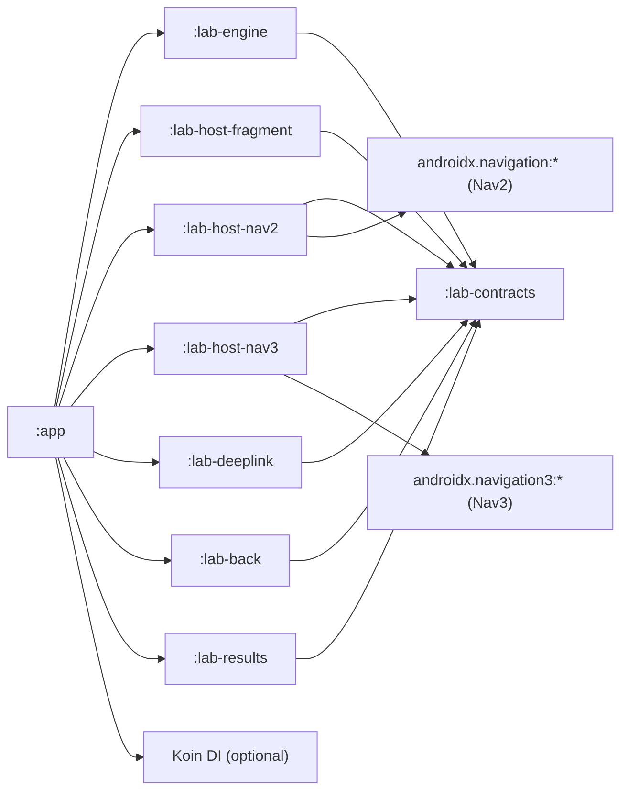

# Navigation Interop Lab: Separate Android Test Project Architecture

## Purpose

Create in current repository test project to validate risky navigation combinations before touching production flow:

- Fragment containers and container visibility ownership
- Nav2 inside Nav3 host and Nav3 inside Nav2 host
- XML <-> Compose screen connection and transitions
- Hybrid back stack behavior (FragmentManager + NavController + Nav3 stack)
- Deeplink handling and fallback correctness
- State restore/process-death behavior for hybrid routes

This document is an implementation blueprint for that test project and a complete case catalog.

---

## Source Analysis (Current Project Patterns To Reproduce)

The lab must reproduce these real patterns from production code.

| Pattern | Current source |
|---|---|
| Activity has `ComposeView` + overlay `FrameLayout` (`flMainOutContainer`) | `app/src/main/res/layout/activity_app.xml:16`, `app/src/main/res/layout/activity_app.xml:22` |
| Legacy `FragmentContainerView` (`legacy_fragment_container`) inflated from Compose via `AndroidViewBinding` | `app/src/main/java/com/example/screens/AppActivityScreen.kt:194`, `app/src/main/res/layout/fragment_legacy_host.xml:11` |
| Legacy container can be inflated late into overlay container | `app/src/main/java/com/example/navigation/UnifiedNavigator.kt:2662` |
| Popup fragment rendered into overlay container | `app/src/main/java/com/example/screens/AppActivity.kt:1740` |
| Fragment-level transaction from Compose feature into activity-level container | `app/src/main/java/com/example/screens/platform/details/trade/data/chart/screens/chart_details/ChartDetailsFragment.kt:255`, `:287` |
| Compose-in-Fragment host base pattern | `core/presentation/src/main/java/com/example/core/presentation/api/mvvm/compose/ComposeMvvmFragment.kt:108` |
| Internal Nav2 graph inside fragment-hosted Compose screen | `features/papers/impl/src/main/kotlin/com/example/features/papers/impl/presentation/legaldocuments/LegalDocumentsFragment.kt:43` |
| Nav2 graphs with `bottomSheet` + `dialog` + custom `dialogFullScreen` | `app/src/main/java/com/example/screens/platform/details/trade/data/chart/screens/chart_details/ChartNavigationScreen.kt:471`, `app/src/main/java/com/example/screens/platform/landscape/DialogFullscreenNavigation.kt:24` |
| Two-tier back handling (`OnBackPressedCallback` + nested stacks) | `features/registration/impl/src/main/kotlin/com/example/features/registration/impl/presentation/RegistrationWizardFragment.kt:90`, `app/src/main/java/com/example/screens/plugins/BackPressHandlerPlugin.kt:82` |
| onResume fallback relies on FragmentManager visibility | `app/src/main/java/com/example/screens/AppActivity.kt:880` |
| Deeplink manager chain short-circuits by boolean | `app/src/main/java/com/example/services/DeeplinkManager.kt:105` |
| Deeplink managers returning `true` even if navigation blocked/no-op | `features/space/api/src/main/kotlin/com/example/features/space/api/domain/SpaceDeeplinkManager.kt:41`, `app/src/main/java/com/example/screens/promocode/services/PromoCodeDeeplinkManager.kt:34`, `features/loyalty/api/src/main/kotlin/com/example/features/loyalty/api/deeplink/LoyaltyDeeplinkManager.kt:29` |
| Non-saveable and runtime-unstable route args | `core/navigation/src/main/kotlin/com/example/navigation/NavigationDestination.kt:55`, `:114` |

---

## Lab Scope

In scope:

- Navigation interoperability testing only (containers, routing, back, restore, deeplinks).
- Controlled fake screens (no business backend dependency).
- Deterministic reproduction of known risky patterns.
- Manual and automated verification modes.

Out of scope:

- Full migration of production app.
- Replacement of production `UnifiedNavigator`.
- Visual parity with production design system.

---

## Proposed Project Architecture

### Module layout

Use a **standalone repository** (not a module inside this repo).

```text
nav2-nav3-migration/
  app/
    src/main/
      AndroidManifest.xml
      java/.../NavigationLabActivity.kt
      res/layout/activity_navigation_lab.xml
  lab-contracts/
    src/main/kotlin/.../
      LabCaseId.kt
      LabScenario.kt
      LabResult.kt
      LabRoute.kt
      LabTraceEvent.kt
  lab-engine/
    src/main/kotlin/.../
      NavigationLabEngine.kt
      casebrowser/
      orchestrator/
      invariants/
  lab-host-fragment/
    src/main/kotlin/.../
      hosts/
      fragments/
  lab-host-nav2/
    src/main/kotlin/.../
      compose/
      nav2/
  lab-host-nav3/
    src/main/kotlin/.../
      nav3/
  lab-deeplink/
    src/main/kotlin/.../
      deeplink/
  lab-back/
    src/main/kotlin/.../
      back/
  lab-results/
    src/main/kotlin/.../
      results/
  lab-testkit/
    src/androidTest/kotlin/.../
  docs/
    architecture.md
    cases.md
    known-issues.md
    sync-with-source-repo.md
```

### Repository strategy

- Create a new Git repository (example name: `navigation-interop-lab`).
- Keep it buildable independently (`./gradlew :app:assembleDebug` in that repo).
- Do not include lab modules into current production `settings.gradle.kts`.
- Do not add runtime dependency from production app to lab repo.

### Dependency boundary policy

- The lab must **not** depend directly on project internals such as:
  - `:app`
  - `:core:*`
  - `:features:*`
  - production `UnifiedNavigator` implementation
- Recreate only minimal contracts and fixtures needed for experiments.
- Keep package names neutral (`com.example.navigationlab.*`) to avoid accidental classpath overlap.
- If production integration checks are needed, use one of:
  - AAR snapshot consumption from CI artifact
  - source sync script that copies small fixture snippets into `lab-fixtures/`
  - never direct module linkage across repositories

### Dependency graph



### Runtime architecture

Core runtime components:

1. `CaseBrowserScreen`
- Lists all lab cases.
- Allows run mode: manual / scripted / stress.

2. `HostTopologyFactory`
- Creates one of host topologies:
  - XML Activity + single fragment container
  - XML Activity + dual containers (`base + overlay`)
  - Compose root + Nav2 host
  - Compose root + Nav3 host
  - Compose root + legacy island (`AndroidViewBinding(FragmentContainerView)`)

3. `InteropBridge`
- Bridges between engines:
  - Nav3 -> Nav2 leaf
  - Nav2 -> Nav3 leaf
  - Compose -> Fragment
  - Fragment -> Compose

4. `BackOrchestrator`
- Models back priority explicitly:
  - overlay dismiss
  - nested child stack pop
  - nav stack pop (Nav2/Nav3)
  - root exit

5. `DeeplinkSimulator`
- Runs deterministic deeplink chain with explicit outcome:
  - `Handled`
  - `Blocked`
  - `Ignored`
  - `Fallback`

6. `LabTraceStore`
- Stores structured event timeline for each scenario:
  - container changes
  - stack changes
  - fragment transactions
  - back events
  - deeplink outcomes

### Synchronization with source repository

Because the lab is in a separate repository, add a documented sync process:

1. Keep a `SOURCE_SNAPSHOT.md` with:
- source repository URL
- source commit SHA used for latest sync
- changed anchor files and line ranges

2. Add `tools/sync/refresh_inventory.sh` in lab repo to refresh:
- NavHost inventory
- deeplink manager chain inventory
- container/back-handler anchor list

3. Run sync regularly (for example once per sprint or before major migration decision).

4. Version every sync update as a separate PR in the lab repo.

### Host topologies to implement in the lab

| Topology ID | Description |
|---|---|
| `T1` | `Activity(XML)` -> `FragmentContainerView` -> Fragments |
| `T2` | `Activity(XML)` -> `ComposeView` -> Nav2 `NavHost` |
| `T3` | `Activity(XML)` -> `ComposeView` -> Nav3 `NavDisplay` |
| `T4` | `Activity(XML)` -> `ComposeView` + overlay `FrameLayout` (dual containers) |
| `T5` | `Nav3 root` -> `LegacyIslandEntry` -> `AndroidViewBinding(FragmentContainerView)` |
| `T6` | Fragment host -> Compose content (`ComposeView`) -> internal Nav2 |
| `T7` | Nav2 route -> Nav3 leaf screen |
| `T8` | Nav3 key -> Nav2 leaf graph |

---

## Complete Case Catalog

Each case must include:
- preconditions
- execution steps
- expected stack/container trace
- expected final UI state
- pass/fail invariant checks

### A. Container and host ownership

| ID | Scenario |
|---|---|
| `A01` | Single deterministic legacy container exists before first navigation. |
| `A02` | Late container inflation fallback path (simulate missing container then inflate into overlay). |
| `A03` | Dual-container visibility race (base vs overlay controller conflict). |
| `A04` | Popup fragment in overlay should not replace base fragment content. |
| `A05` | Overlay removal restores previous base content and back stack invariants. |
| `A06` | Navigation call arrives before host inflation complete. |
| `A07` | Rotation while overlay visible keeps container ownership stable. |

### B. Nav2/Nav3 interoperability

| ID | Scenario |
|---|---|
| `B01` | Pure Nav2 graph baseline (no fragments). |
| `B02` | Pure Nav3 graph baseline (no fragments). |
| `B03` | Nav3 root key renders Nav2 leaf graph (`Nav3 -> Nav2`). |
| `B04` | Nav2 route renders Nav3 leaf (`Nav2 -> Nav3`). |
| `B05` | Nav3 root + legacy island fragment host (`Nav3 -> FragmentManager`). |
| `B06` | Nav2 route triggers fragment transaction in activity container. |
| `B07` | Fragment screen launches Nav2 dialog and returns result. |
| `B08` | Fragment screen launches Nav3 modal entry and returns result. |
| `B09` | Nested chain stress: Nav3 -> Nav2 -> Fragment -> Nav2 dialog -> back unwind. |
| `B10` | Cross-engine pop: pop from child engine should not corrupt parent stack. |
| `B11` | `singleTop` semantics parity for equivalent Nav2 and Nav3 routes. |
| `B12` | Clear-to-root parity across interop boundaries. |

### C. XML <-> Compose screen connection

| ID | Scenario |
|---|---|
| `C01` | XML Activity hosts Compose root; compose route opens fragment. |
| `C02` | Compose route hosts XML via `AndroidViewBinding` and keeps state. |
| `C03` | Fragment hosts ComposeView with internal nav graph. |
| `C04` | Compose screen opens XML dialog fragment and receives result. |
| `C05` | XML fragment opens Compose dialog/sheet and receives result. |
| `C06` | XML arguments -> Compose route args mapping correctness. |
| `C07` | Compose route args -> Fragment arguments mapping correctness. |
| `C08` | Recreate activity and verify XML/Compose bridge rebuild order. |

### D. Dialog/bottom-sheet/overlay semantics

| ID | Scenario |
|---|---|
| `D01` | Nav2 `bottomSheet` route behavior baseline. |
| `D02` | Nav2 `dialog` route behavior baseline. |
| `D03` | Custom `dialogFullScreen` behavior baseline. |
| `D04` | Overlay fragment above Nav2 sheet; back order correctness. |
| `D05` | Overlay fragment above Nav3 entry; back order correctness. |
| `D06` | Simultaneous nested overlays from child and activity managers. |
| `D07` | Sheet dismiss should not pop parent graph unexpectedly. |
| `D08` | Fullscreen dialog should preserve transparent-background semantics. |
| `D09` | Transition from overlay fragment back into compose sheet state. |

### E. Back handling and nested stacks

| ID | Scenario |
|---|---|
| `E01` | Compose `BackHandler` only. |
| `E02` | Fragment `OnBackPressedCallback` only. |
| `E03` | Two-tier back (Compose BackHandler + Fragment callback). |
| `E04` | Wizard-like childFragmentManager stack handling. |
| `E05` | Back from mixed stack where top is activity overlay fragment. |
| `E06` | Back from root should trigger exit logic only once (double-back policy). |
| `E07` | Back after deep-link fallback pop chain. |
| `E08` | Back while pending transaction exists (`executePendingTransactions` edge). |

### F. Deeplink and fallback behavior

| ID | Scenario |
|---|---|
| `F01` | Deeplink handled by first matching manager with actual navigation. |
| `F02` | Manager returns handled=true but performs no navigation (suppression bug simulation). |
| `F03` | Feature blocked result (no navigation) should route to fallback, not clear deeplink. |
| `F04` | Unknown path fallback to menu navigator. |
| `F05` | Deeplink arrives before nav host ready. |
| `F06` | Deeplink during active screen-channel mode (`sendToChannel=true` style). |
| `F07` | Deeplink after process death restore should resume deterministic route. |
| `F08` | Deeplink source attribution consistency (intent vs internal source). |

### G. State restore and argument stability

| ID | Scenario |
|---|---|
| `G01` | Rotation with Nav2 stack + fragment overlay. |
| `G02` | Rotation with Nav3 stack + Nav2 leaf graph. |
| `G03` | Process death restore of Nav3 back stack keys. |
| `G04` | Process death restore of legacy fragment stack in island mode. |
| `G05` | Non-saveable argument injection failure case (lambda-like arg). |
| `G06` | Runtime default argument drift case (value resolved at different times). |
| `G07` | Restore when dialog/sheet is top-most destination. |

### H. Transaction safety and race conditions

| ID | Scenario |
|---|---|
| `H01` | `commitAllowingStateLoss` during `onStop` / background transition. |
| `H02` | Rapid repeated navigate/pop causing interleaved transactions. |
| `H03` | `executePendingTransactions` impact on ordering guarantees. |
| `H04` | Concurrent navigation events from two sources (UI + deeplink). |
| `H05` | Container visibility update races with transaction commit. |

---

## Test Strategy

### Manual mode

- Case browser UI with step-by-step runbook.
- Live timeline panel with:
  - active host topology
  - fragment list
  - Nav2 back stack snapshot
  - Nav3 back stack snapshot
  - container visibility state

### Automated mode

1. Instrumentation tests (`androidTest`) per case family.
2. Hybrid Espresso + Compose test APIs.
3. Deterministic fake deeplink providers.
4. Snapshot assertion of trace events (`LabTraceStore`).

Minimum automated coverage before using lab for migration decisions:

- all `A*`, `B*`, `E*`, `F*`, `G*` critical paths
- at least one stress test from `H*`

---

## Delivery Milestones

| Milestone | Output |
|---|---|
| `M1` | New standalone repo boots (`:app`), case browser opens, `T1/T2/T3` topologies implemented. |
| `M2` | All `A*`, `B*`, `C*` cases implemented and manually runnable. |
| `M3` | `D*`, `E*`, `F*` cases implemented; trace logging and pass/fail invariants active. |
| `M4` | `G*`, `H*` cases automated in `androidTest`; CI smoke pipeline added in the standalone repo. |
